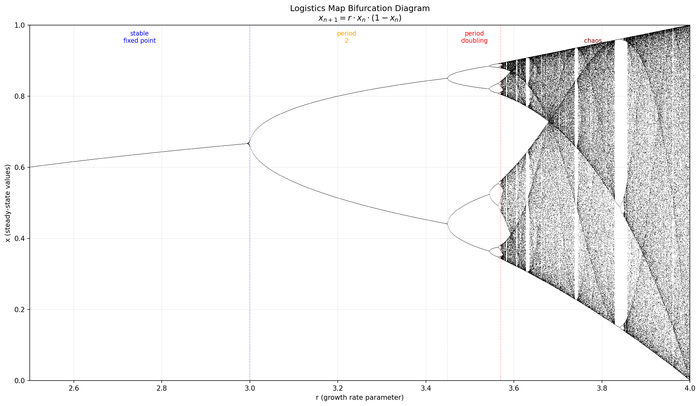
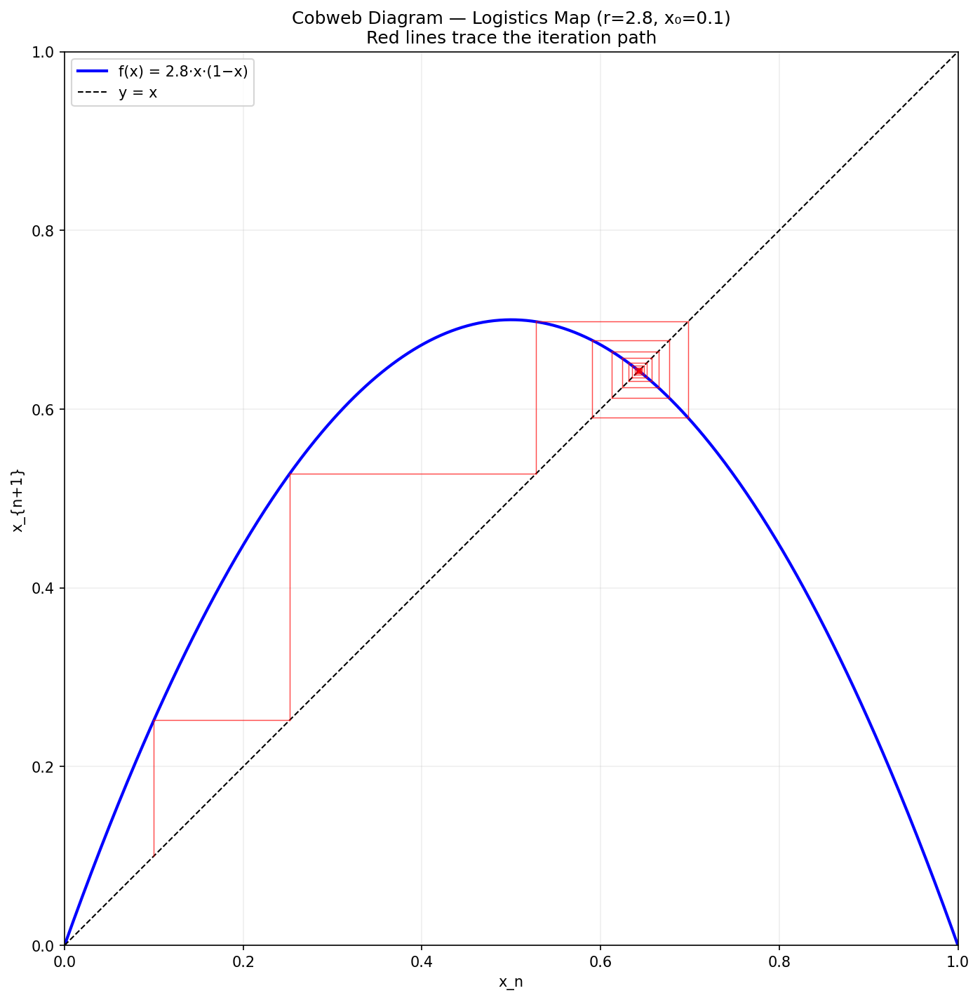
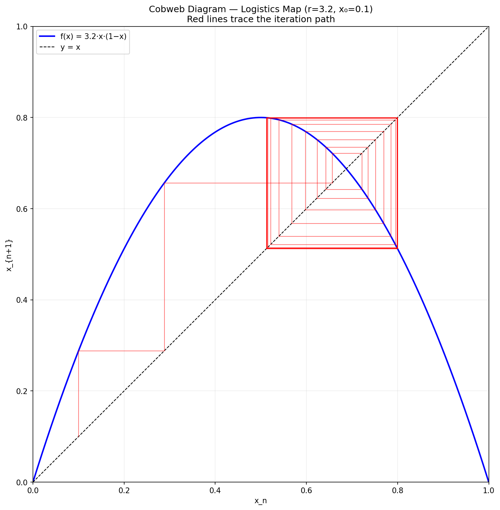
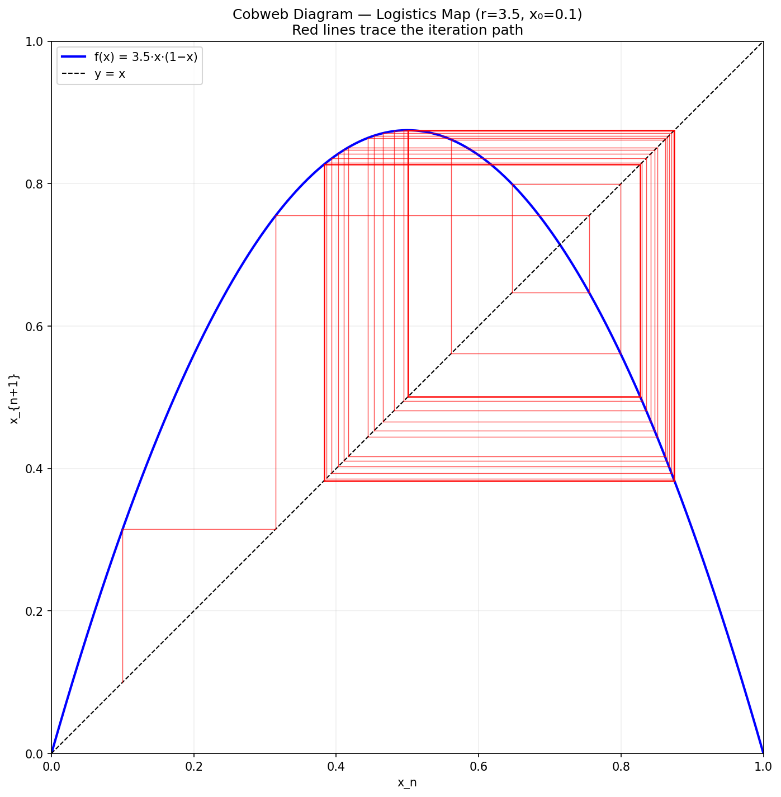
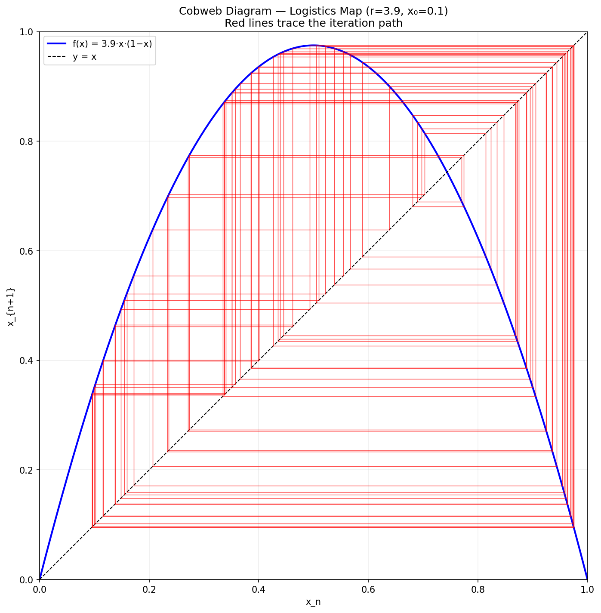

# Learning PyTorch

A conceptual deep-dive, built incrementally. This document grows alongside the
case studies.

---

## 1. What PyTorch Is

PyTorch is a Python library that provides two things:

1. **Tensors** — analogous to NumPy n-dimensional arrays, but adapted to GPUs and track math operations
2. **Automatic differentiation** — given a computation that maps model parameters
   to a loss value, PyTorch computes how to adjust those parameters to reduce the
   loss (gradients). The data is fixed; the parameters are what move.

Other PyTorch features — layers, networks, optimizers, data loaders — are built on top
of these two primitives.


---

## 2. Tensors

A tensor is a multi-dimensional array of numbers.

**Properties:**
- **Rectangular:** all dimensions are fixed-length. A 3×4×5 tensor has exactly 60 elements.
  No ragged or variable-length axes.
- **Homogeneous:** every element has the same data type (float32, int64, etc.). This is
  what makes GPU computation fast — contiguous memory with uniform stride.
- **Arbitrary rank:** scalars (rank 0), vectors (rank 1), matrices (rank 2), or higher.


**Relation to algebra:** The elements are drawn from ℝ (or ℂ), which are fields. The
array itself is like a vector space element — a member of ℝ^(d1 × d2 × ... × dn).
But PyTorch doesn't enforce field axioms; it's a data container that supports
arithmetic.


**PyTorch Tensor vs. mathematical tensor:** In math, a tensor transforms in specific
ways under coordinate changes (covariant/contravariant indices). In PyTorch, "tensor"
just means "N-dimensional array." No transformation rules, no index gymnastics. The
name was borrowed because the operations (multiply, contract, reshape) mirror what you
do with mathematical tensors, but a PyTorch Tensor has no concept of covariance. It's
just a box of numbers with a shape.


| Shape | What it represents |
|-------|-------------------|
| `()` | A scalar (one number) |
| `(5,)` | A vector (5 numbers). The comma is Python tuple syntax: `(5)` is just the int 5; `(5,)` is a one-element tuple. |
| `(3, 4)` | A matrix (3 rows × 4 columns) |
| `(64, 1, 28, 28)` | A batch of 64 grayscale 28×28 images |
| `(16, 3, 224, 224)` | A batch of 16 RGB 224×224 images |


```python
import torch

x = torch.tensor([1.0, 2.0, 3.0])       # shape (3,)
m = torch.randn(3, 4)                     # shape (3, 4), random normal values
batch = torch.randn(64, 1, 28, 28)        # a batch of MNIST images
```

**`randn`** = random normal. Fills the tensor with values drawn from a standard
normal distribution (mean=0, std=1). Also: `rand` (uniform 0–1), `zeros`, `ones`.

### Why not just use NumPy?

- Tensors can live on GPU (`x.to("cuda")`) for massive parallelism
- Tensors track their computational history for automatic differentiation
- The API is nearly identical to NumPy — easy transition

### Key operations

```python
# Element-wise
y = x * 2        # multiply every element by 2
z = x + y        # add element-wise

# Matrix multiply
a = torch.randn(3, 4)
b = torch.randn(4, 5)
c = a @ b        # shape (3, 5)

# Reshaping
flat = batch.view(64, 784)  # flatten 28×28 images to 784-length vectors
```

---

## 3. What a Neural Network Actually Is

A neural network is a **function** — it takes input numbers and produces output
numbers. The function is defined by **parameters** (weights and biases) that
start random and are adjusted during training.

The simplest possible network (one layer):

```
output = input @ weights + bias
```

That's a linear transformation (matrix multiply + add). By itself, this can only
learn linear relationships. To learn complex patterns, we stack multiple layers
with **nonlinearities** (activation functions) between them:

```
hidden1 = relu(input @ W1 + b1)      # first hidden layer
hidden2 = relu(hidden1 @ W2 + b2)    # second hidden layer
output  = hidden2 @ W3 + b3          # output layer (no activation)
```

Layers between input and output are called **hidden layers**. The output layer
typically has no activation (for regression) or a special one like softmax (for
classification).

### Why ReLU?

ReLU (Rectified Linear Unit) is the simplest nonlinearity: `max(0, x)`. It
zeroes out negative values. Without it, stacking linear layers just produces
another linear layer — no matter how many you stack. The nonlinearity is what
gives the network its power to approximate complex functions.

### The Universal Approximation Theorem

A neural network with at least **one hidden layer** and a nonlinear activation can
approximate **any continuous function** to arbitrary precision, given enough
neurons. This is the theoretical justification for why neural networks work at all.

Technically, one ReLU hidden layer suffices for the theorem. In practice, we use
multiple hidden layers because: (a) fewer total neurons are needed to reach the
same accuracy, and (b) deeper networks learn hierarchical features (edges →
textures → shapes → objects). Each ReLU after each hidden layer introduces another
"fold" in the function the network can represent.

### Clarification: "Fold" means kink, not polynomial order

ReLU networks don't produce smooth curves like polynomials. They produce
**piecewise-linear** functions — many straight segments joined at corners (kinks).
A single ReLU neuron creates one kink. 100 ReLU neurons in a hidden layer can
produce up to 100 kinks — 100 linear segments joined together. The network
approximates curves not by being smooth, but by having enough tiny straight pieces
in the right places.

Adding depth (more layers) multiplies possible kinks exponentially rather than
linearly. That's the efficiency argument for deeper architectures.

A historical aside: If someone had handed Planck a sufficiently wide ReLU network
in 1898 along with a table of blackbody radiation data, it might have fit the
curve perfectly with 500 piecewise-linear segments — and told him nothing about
quantized energy. The interpolation would have been a triumph; the physics would
have remained hidden. Fortunately for science, the smooth functions of the era
*couldn't* fit the data, forcing Planck toward his quantum hypothesis. The lesson:
a neural network that fits data well is not the same as understanding the data.

### Anatomy of a connection: Weights, biases, and ReLU

Consider 468 input neurons connecting to 1000 hidden neurons. What lives where?

- **W1** is a matrix of shape (468, 1000). Element W1[7, 12] is the weight on the
  wire from input neuron 7 to hidden neuron 12. It scales how much neuron 7's
  value contributes to neuron 12.
- **b1** is a vector of shape (1000,). Element b1[12] is the bias for hidden neuron
  12. There is one bias *per hidden neuron*, not one per wire. It shifts the
  total signal arriving at neuron 12 before the activation fires.
- **ReLU** is applied *per hidden neuron*, after all incoming wires are summed.
  Hidden neuron 12 computes: `relu(W1[0,12]*x[0] + W1[1,12]*x[1] + ... + W1[467,12]*x[467] + b1[12])`
  where x[i] is the value (activation) of the i'th input neuron.

In the canonical diagram:
```
input neuron 7 ──── W1[7,12] ────┐
input neuron 8 ──── W1[8,12] ────┤
...                               ├──→ sum + b1[12] ──→ relu ──→ hidden1 neuron 12
input neuron 467 ── W1[467,12] ──┘
```

So: weights live on the wires, one bias lives at each destination neuron, and ReLU
fires once per neuron (not once per wire). Total parameters for this layer:
468×1000 weights + 1000 biases = 469,000 learnable values.

### Inputs and Outputs: What goes in, what comes out

**Input:** A serialized, standardized representation of one data element. For a
CIFAR-10 image (32×32 pixels, 3 color channels), the input is a tensor of shape
(3, 32, 32) = 3,072 numbers, each a pixel intensity normalized to [0, 1] or
[-1, 1]. For MNIST (28×28, grayscale): 784 numbers. The "standardizing rules"
ensure every input is the same shape and scale — the network expects uniform geometry.

**Output for classification (e.g. CIFAR-10, 10 classes):** The output layer has
10 neurons, each producing a raw score (called a "logit") for one class. It's
NOT binary lighting-up. Instead:

```
output = [2.1, -0.3, 0.5, -1.2, 4.7, 0.1, -0.8, 0.3, 1.0, -2.0]
              airplane  auto   bird  cat  deer  dog  frog horse ship truck
```

The highest value wins (here: deer, with score 4.7). To convert these raw scores
into probabilities that sum to 1, we apply **softmax**:

```
probs = softmax(output) → [0.02, 0.01, 0.03, 0.01, 0.82, 0.02, 0.01, 0.02, 0.04, 0.01]
```

Now the network says "82% confident it's a deer." The loss function (cross-entropy)
penalizes the network based on how much probability it assigned to the *wrong* classes.

So: 10 output neurons, all active with different magnitudes, softmax converts to
a probability distribution, highest probability is the classification answer.

---

## 4. The Training Loop

Training a neural network means finding parameter values that make the outputs
correct. This is an optimization problem:

1. **Forward pass** — feed data through the network, get a prediction
2. **Loss** — measure how wrong the prediction is
3. **Backward pass** — compute gradients (how should each weight change to
   reduce the loss?)
4. **Update** — nudge weights in the direction that reduces loss
5. **Repeat** — thousands or millions of times

```python
for epoch in range(num_epochs):
    for batch_inputs, batch_labels in dataloader:
        # Forward
        predictions = model(batch_inputs)
        loss = loss_function(predictions, batch_labels)

        # Backward
        loss.backward()  # computes gradients for every parameter

        # Update
        optimizer.step()       # applies gradients to parameters
        optimizer.zero_grad()  # resets gradients for next iteration
```

This loop is **the same for every neural network ever trained** — from a 3-layer
digit classifier to GPT-4. The only things that change are the model architecture,
the data, and the loss function.

---

## 5. Backpropagation and Automatic Differentiation

**The key distinction:** Data is fixed. Weights (parameters) are what get adjusted.

```
data (fixed) ──→ model(weights) ──→ prediction ──→ loss
                    ↑                                 |
                    └─── gradients ← loss.backward() ─┘
```

`loss.backward()` computes ∂loss/∂weight for every weight in the model — NOT
∂loss/∂input. The data flows through the model unchanged; the weights are what move.

**How it works:** PyTorch records every operation you perform on tensors (multiply,
add, relu, etc.) in a computational graph. When you call `.backward()`, it traverses
that graph in reverse, applying the chain rule to compute the gradient of the loss
with respect to every parameter that has `requires_grad=True`.

You never write derivative code. You write the forward pass; PyTorch handles
the backward pass automatically.

### Intuition

Imagine a river flowing downhill. The loss is your altitude. Gradients tell you
which direction is downhill from where you are. The optimizer takes a step in
that direction. Repeat until you reach a valley (minimum loss).

The catch: the landscape has many valleys (local minima), ridges, saddle points,
and plateaus. Optimizers like Adam are designed to navigate this terrain robustly.

---

## 6. Layers in PyTorch

PyTorch provides building blocks in `torch.nn` (nn = neural network):

| Layer | What it does |
|-------|-------------|
| `nn.Linear(in, out)` | Matrix multiply + bias (fully connected) |
| `nn.Conv2d(in_ch, out_ch, kernel)` | 2D convolution (spatial patterns in images) |
| `nn.ReLU()` | Zero out negatives |
| `nn.Sigmoid()` | Squash to [0, 1] (probabilities) |
| `nn.Softmax(dim)` | Squash to probabilities that sum to 1 |
| `nn.Dropout(p)` | Randomly zero out neurons (prevents overfitting) |
| `nn.BatchNorm2d(ch)` | Normalize activations (stabilizes training) |
| `nn.LSTM(in, hidden)` | Recurrent layer for sequences |

You compose them into a network by subclassing `nn.Module`:

```python
class MyNet(nn.Module):
    def __init__(self):
        super().__init__()
        self.layer1 = nn.Linear(784, 128)
        self.layer2 = nn.Linear(128, 10)
        self.relu = nn.ReLU()

    def forward(self, x):
        x = x.view(-1, 784)     # flatten
        x = self.relu(self.layer1(x))
        x = self.layer2(x)
        return x
```

---

## 7. Loss Functions

The loss function measures how wrong the prediction is. Common choices:

| Loss | Used for | Formula (intuition) |
|------|---------|-------------------|
| `nn.CrossEntropyLoss` | Classification (pick one of N classes) | How surprised are we by the wrong answer? |
| `nn.MSELoss` | Regression (predict a number) | Average squared error |
| `nn.BCELoss` | Binary classification (yes/no) | Log probability of correct answer |

The loss is a single number. Smaller = better. The entire training process is
just minimizing this number.

---

## 8. Optimizers

An optimizer uses gradients to update weights. The simplest:

**SGD (Stochastic Gradient Descent):**
```
weight = weight - learning_rate * gradient
```

**Adam** (the default choice for most work):
- Maintains a running average of gradients and squared gradients
- Adapts the learning rate per-parameter
- Handles noisy gradients and sparse features well

```python
optimizer = torch.optim.Adam(model.parameters(), lr=0.001)
```

The **learning rate** (LR, denoted η) is the most important hyperparameter. Too high: training
diverges. Too low: training takes forever. Typical starting point: 0.001.

---

## 9. Data Loading

PyTorch's `DataLoader` handles batching, shuffling, and parallel data loading:

```python
from torch.utils.data import DataLoader
from torchvision import datasets, transforms

transform = transforms.Compose([
    transforms.ToTensor(),
    transforms.Normalize((0.5,), (0.5,))
])

train_data = datasets.MNIST(root="./data", train=True, transform=transform)
train_loader = DataLoader(train_data, batch_size=64, shuffle=True)
```

Each iteration of the DataLoader yields one batch: a tensor of images and a
tensor of labels, ready for the forward pass.

---

## 10. GPU Acceleration

Moving computation to GPU is one line:

```python
device = torch.device("cuda" if torch.cuda.is_available() else "cpu")
model = model.to(device)

# In the training loop:
inputs = inputs.to(device)
labels = labels.to(device)
```

For MNIST on a laptop CPU: training takes ~2 minutes.
On a GPU: ~10 seconds. The difference grows enormously for larger models.

---

## 11. Types of Neural Networks

| Type | What it's for | Key idea |
|------|--------------|----------|
| **Feedforward (MLP)** | Tabular data, simple classification | Layers in sequence, no loops. The "vanilla" network. |
| **Convolutional (CNN)** | Images, spatial data | Layers detect local patterns (edges, textures) using small sliding filters. Translation-invariant. |
| **Recurrent (RNN/LSTM/GRU)** | Sequences, time series, text | Has memory — output depends on current input AND previous states. Loops in the graph. |
| **Transformer** | Text, code, anything sequential at scale | Attention mechanism: every element "looks at" every other element. No recurrence. Powers GPT, BERT, Claude. |
| **Autoencoder** | Compression, denoising, feature learning | Encodes input to a small representation, then decodes back. Learns what's essential. |
| **Variational Autoencoder (VAE)** | Generative modeling | Like autoencoder but the latent space is probabilistic. Can sample new data. |
| **GAN** | Image/data generation | Two networks competing: generator makes fakes, discriminator catches them. |
| **Diffusion model** | High-quality image generation | Learns to remove noise step by step. Powers DALL-E, Stable Diffusion, Midjourney. |
| **Graph Neural Network (GNN)** | Molecular structure, social networks | Operates on graph-structured data (nodes + edges) rather than grids. |
| **Physics-Informed NN (PINN)** | Scientific simulation | Encodes physical laws (PDEs) as constraints in the loss function. |

**Relevant to our case studies:**
- Case Study 01: CNN (ResNet-18, image classification via convolutions)
- Case Study 02: MLP/Feedforward (the simplest, from scratch)
- Case Study 04: GAN (two MLPs or CNNs competing)

---

## 12. Analogy from Nonlinear Dynamics

The logistics map x_{n+1} = r · x_n · (1 - x_n) is the simplest system that
transitions from predictable to chaotic behavior as a parameter changes.

### Bifurcation Diagram

{ width=80% }

\newpage

### Cobweb Diagrams

The following four diagrams show the logistics map iterated at different r values.

**r = 2.8: Convergence to a stable fixed point**

\

{ width=70% }

\newpage

**r = 3.2: Period-2 oscillation**

\

{ width=70% }

\newpage

**r = 3.5: Period-4**

\

{ width=70% }

\newpage

**r = 3.9: Chaos**

\

{ width=70% }

Script: `logistics_map.py` in the repo root.

### The Mapping: Logistics Map → Neural Network Training

The logistics map is a one-dimensional iterated map with one parameter (r).
Neural network training is a million-dimensional iterated map with one key
parameter (learning rate η). The structural parallel:

| Logistics map | Neural network training |
|--------------|------------------------|
| State: x (one number) | State: all weights W (millions of numbers) |
| Update rule: x_{n+1} = f(x_n, r) | Update rule: W_{n+1} = W_n - η·∇L(W_n) |
| Parameter: r (growth rate) | Parameter: η (learning rate) |
| Fixed point: x converges | Convergence: loss reaches a minimum |
| Period-2: x oscillates between 2 values | Oscillation: loss bounces between values |
| Chaos: x never settles | Divergence: loss explodes, training fails |

Gradient descent IS an iterated map. Each training step applies a function to
the current state (weights) to produce the next state. The learning rate controls
how aggressively you iterate — exactly as r controls the logistics map.

For GANs: you have two coupled maps (generator and discriminator updates), analogous
to coupled logistics maps — a system known to exhibit synchronization,
anti-synchronization, and hyperchaos.

| r value | Behavior | Neural network analog |
|---------|----------|----------------------|
| 1–3 | Stable fixed point | Convergent training (good LR) |
| 3–3.45 | Period-2 oscillation | Loss oscillating (LR slightly high) |
| 3.45–3.57 | Period doubling cascade | Increasing instability |
| > 3.57 | Chaos | Divergent training (LR too high) |
| Periodic windows | Brief order within chaos | Sudden improvements after plateaus |

The cobweb diagram shows convergence to a fixed point — directly analogous to how
gradient descent spirals toward a loss minimum. When the system bifurcates, the
optimizer oscillates between two values instead of settling.

### The Deeper Insight: What Converges, and Toward What

Both the logistics map and neural network training are **iteration-based solvers.**
But what they iterate toward, and the role of their control parameters, differ
in an illuminating way.

Interpreting the comparison is instructive but not simple. We follow a plan of
giving a first-cut interpretation and then refining it twice to be more accurate.

**First cut:**

Both the LM and the NN solve programs are based in iteration. In the case of the
LM we are iterating in the sense of letting time advance toward a potentially
stable end state for the one characteristic parameter x (dependent on control
parameter r). In the case of the NN we are iterating to carefully/gradually
traverse a multi-dimensional loss hypersurface to arrive at a relatively flat
solution region with minimum loss value: gradient descent. A distinction between
them is that the control parameter r is a deterministic dial value choosing a
particular fate; whereas η is itself subject to optimization as a hyperparameter
and the question is "Can η lead to the one and only *correct* fate?"

**Refinement 1: There is no unique correct fate.**

The answer to that question illuminates a real difference. For the LM, there IS
one fate per r — it's mathematically determined. For the NN, there is generally
NO unique correct fate. The loss landscape has many local minima that are all
"good enough." Different η values (and different random initializations) lead to
different final weight configurations that perform comparably. So η doesn't select
a unique fate; it influences *which* of many acceptable fates you land in. The
practical question isn't "did we find THE answer" but "did we find AN answer that
generalizes well to unseen data?"

**Refinement 2: The r-to-η analogy breaks down further.**

r and η are not truly analogous. r is part of the *system definition* — change r
and you have a different logistics map with different dynamics and a different fate.
η is part of the *solver* — change η and you have the same problem (same loss
landscape) being solved with different step sizes. The NN's actual r-equivalent
would be the architecture and data: change the dataset or the network structure
and you have a fundamentally different loss landscape. η does not define the system;
it is a procedural choice about how to navigate a system that is already defined
by the model architecture, the data, and the loss function.

**The loss surface** (loss landscape): A scalar-valued function L(W) defined over
the high-dimensional parameter space. Every possible setting of all weights
corresponds to a point; the loss function assigns a height (error) to that point.
The gradient ∇L points uphill; we step opposite (downhill). The surface has valleys
(good solutions), ridges, saddle points, and plateaus.

---

## What's Next

- **Sections 5–10 Q&A:** Revisit these sections with questions once hands-on work begins.
  (Skipped for now to maintain momentum toward code.)
- **Case Study 01:** Apply this knowledge — fine-tune a pre-trained model
- **Case Study 02:** Build everything from scratch — implement the training loop by hand
- **Case Study 04:** Two networks competing (GAN) — dynamical systems with two coupled maps
- **CUDA:** Confirmed available on the Dell laptop. GPU training is an option.

---

*This document is a living reference. It will be updated as understanding deepens
through hands-on work in the case studies.*

---

## Appendix: Generating this PDF

```bash
pandoc LearnPyTorch.md -o LearnPyTorch.pdf \
  --pdf-engine=xelatex \
  -V mainfont="DejaVu Serif" \
  -V monofont="DejaVu Sans Mono" \
  -f markdown-implicit_figures
```
