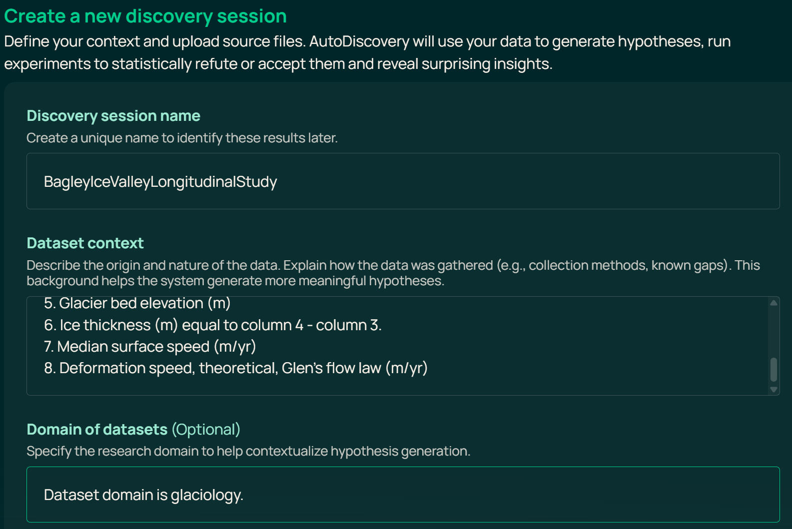
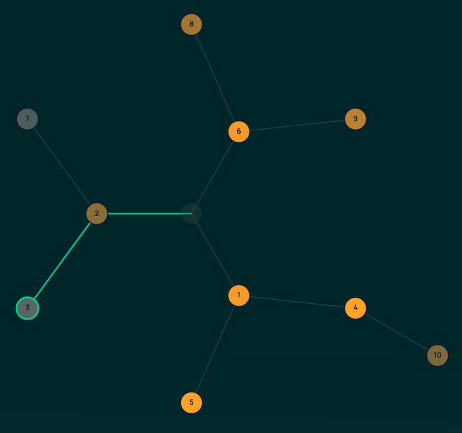
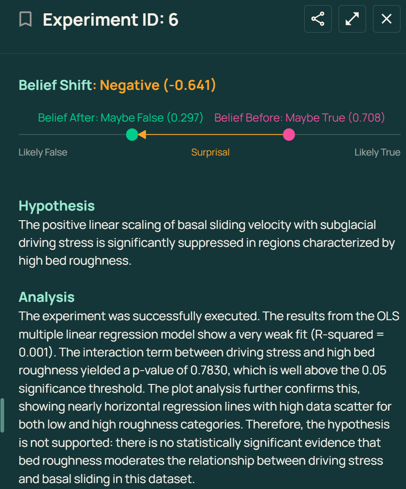
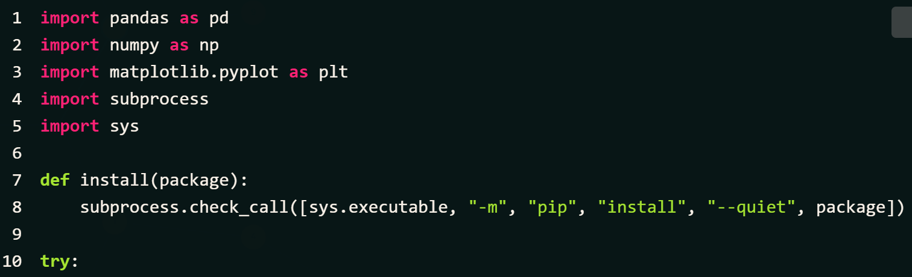
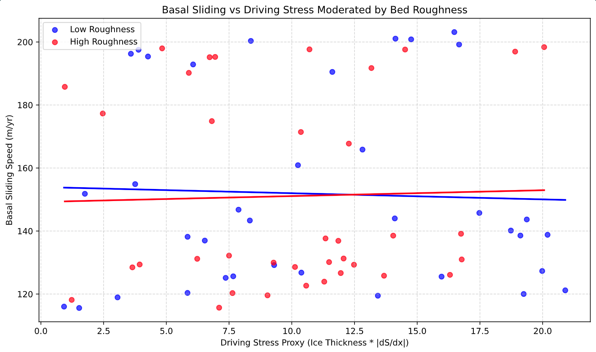

<!-- _header: "" -->
<!-- _paginate: false -->
<!-- _footer: "" -->


# Using Programmatic AWS-AI for Scientific Research

**CloudBank Cloud Clinic June 2026**

Using: AWS Bedrock, AI2 Asta and the AWS `kiro` IDE

---

<!-- _footer: "" -->

<style scoped>
li { font-size: 0.75em; }
</style>

# Previous CloudBank Cloud Clinics...

- Checkpointing and preemptible instances
- Mounting buckets on localhost
- Environmental sustainability on the cloud
- SkyPilot any-cloud cost optimized job management
- Virtual machines and their images
- Capacity blocks for machine learning
- Data publication and APIs
- Containerization with Docker
- Scaling out processing tasks (more containers)
- Working with coding assistants
- Connecting Azure to GitHub


---

>Terminology: The non-profit Allen Institute for Artificial Intelligence will be abbreviated "**AI2**". 


## Theme for today


Imagine we are glaciologists interested in glacier thickness and surface velocity in Alaska. We have access to the AWS cloud and therefore to the AWS Bedrock "Foundation Model" service. This service can route our AI prompts to the Anthropic Claude LLM: We hope a helpful research tool. 


---


## Theme continued


- Suppose also we use the `kiro` Integrated Development Environment. Based on VS Code it includes a built-in AI Coding Assistant. (Paid subscription enabled: $20/month) 


- Finally: AI2 offers AI-powered research services


- 3 modes { AWS Bedrock API, `kiro` IDE, AI2 "Asta" research tools}


(Demo: All 3)


---


## Plan of action


1. AI2 Semantic Scholar API: Locate a paper
2. Download the paper; extract text and figures
3. Use AWS Bedrock to summarize the paper
4. Identify associated code and data
5. `kiro` > Python > charts
6. Pose a related research question
7. Asta AutoDiscovery experiment
8. Cost accounting
9. Make everything Open/Public
10. Reflection: Use of the `kiro` IDE

---

## Step 1 · AI2 Semantic Scholar API: Locate a paper


The NASA *IceBridge* mission includes glaciers in and near Alaska. We ask the AI2 Semantic Scholar service to find related publications.


<style scoped>
p, strong { font-size: 0.85em; }
code { font-size: 0.8em; }
</style>

**Tool:** localhost/kiro > AI2 Semantic Scholar REST API

```python
import requests

SEARCH_URL = "https://api.semanticscholar.org/graph/v1/paper/search"
params = {
    "query": "Alaskan glacier depths airborne radar sounding IceBridge",
    "fields": "title,authors,year,externalIds,openAccessPdf",
    "limit": 5,
}
response = requests.get(SEARCH_URL, params=params)
```

**Result:** Tober et al., "Alaskan Glacier Depths from a Decade of Airborne Radar Sounding"
DOI: `10.31223/X53T78` · https://eartharxiv.org/repository/etc

---

## Aside: Digital Object Identifiers (DOI)


laptop > Semantic Scholar > DOI > `doi.org` > EarthArXiv > PDF download link


- Semantic Scholar (AI2): Focus on associative exploration of published research
- `kiro` sorted out the SS API from online documentation
- `kiro` wrote a `find_paper.py` Python program
- The query was 8 lines of Python code (`requests` library)
- The target paper was found at EarthArXiv
- DOI > queryable, citable, connectable knowledge graph


---

## Step 2 · Download the paper; extract text and figures


**Tool:** pymupdf (localhost, no network)


"You will need to install X" pattern


```python
import pymupdf

doc = pymupdf.open("tober_2025_alaskan_glacier_depths.pdf")
text = "\n".join(page.get_text() for page in doc)
```


- 43 pages → 79,738 characters
- Clean extraction
- Fits within Sonnet's 200k token context window
- extract_figures.py (installed Pillow)

---

## From the Paper: Bed Elevation (Tober et al Fig. 4a)


*Tober et al. (2025), CC BY 4.0*

---

## From the Paper: Ice Thickness (Tober et al Fig. 4b)


*Tober et al. (2025), CC BY 4.0*

---

## Step 3 · Use AWS Bedrock to summarize the paper

**Tool:** boto3 → Bedrock → Claude Sonnet

```python
import boto3, json

client = boto3.client("bedrock-runtime", region_name="us-west-2")
body = json.dumps({
    "anthropic_version": "bedrock-2023-05-31",
    "max_tokens": 4096,
    "messages": [{"role": "user", "content": prompt}]
})
response = client.invoke_model(
    modelId="us.anthropic.claude-sonnet-4-6",
    contentType="application/json",
    accept="application/json",
    body=body
)
```

---

## Step 3 · Summary Result


**Key findings from the paper:**


- First comprehensive analysis of NASA Operation IceBridge radar data in Alaska (2012–2021)
- Over 5,500 linear-km of ice thickness measurements
- Many glacier termini have overdeepened beds
- Implications for proglacial lake formation and natural hazards

---

## Step 4 · Identify associated code and data

**Question to Sonnet:** "Does this paper reference code or data repositories?"

- **Code:** RAGU (Radar Analysis Graphical Utility) — `github.com/btobers/RAGU`
- **Data:** "Available upon manuscript publication" (per EarthArXiv metadata)
- **IceBridge source data:** Archived at NSIDC (NASA)


What about ice velocities? *Different* project called "ITS LIVE", details omitted for time.

---

## Step 5 · `kiro` > Python > charts


IceBridge (250 m) glacier thickness, ITS_LIVE velocities


---


## Step 6 · Pose a Related Research Question


**Prompt to Sonnet:** From a 1 degree surface slope and 650 to 1200 meter ice thickness: Calculated deformation speed ranges from 15 to 100 meters per year. Observed speed ranges from 140 to 220 meters per year implying basal sliding varying from 40 to 150 meters per year along an 18 km segment of the Bagley Ice Valley. Are there estimates in the literature for sliding speed relevant to these estimates: Both in magnitude and variability?  


`kiro` > Python > Bedrock > Sonnet > `bedrock_response.md`

---

## Step 7 · Asta AutoDiscovery Experiments

**Tool:** Semantic Scholar API

```python
params = {
    "query": "overdeepened glacier beds proglacial lake Alaska retreat",
    "fields": "title,authors,year,citationCount",
    "limit": 10,
}
```

Returns a curated list of related work — building a literature review programmatically.

---

## 7 continued Asta AutoDiscovery





---





---





---





---





---

## Step 8 · Cost Accounting

| Call | Input Tokens | Output Tokens | Cost |
|------|-------------|---------------|------|
| Summarize | 27,257 | 2,111 | $0.11 |
| Code/data | ~27,000 | ~500 | $0.09 |
| Hypothesis | ~27,000 | ~300 | $0.09 |
| **Total** | | | **~$0.29** |

---

## Step 9 · Making Everything Open/Public

All of this lives in the `mimetes` repository:

```
mimetes/case_studies/03_arXiv/
├── find_paper.py        # Step 1: Search + download
├── extract_text.py      # Step 2: PDF → text
├── summarize.py         # Steps 3–4: Bedrock calls
├── bagley_profile.py    # Step 5: Chart from data
├── get_velocity.py      # Step 5: ITS_LIVE integration
├── StudyPlan.md         # Documentation
└── presentation.md      # This slide deck
```

Reproducible. Version-controlled.

---

## Step 10 · Building with the Kiro IDE

**Kiro** — an AI-assisted IDE built on VS Code

- This case study (in the `mimetes` repository) developed interactively with Kiro
- Steering files guide Coding Assistant behavior
- `kiro` can unilaterally adapt to API / MCP servers
- The tool that builds the tool that supports the science

---

## Summary

| What | How |
|------|-----|
| Find papers | Semantic Scholar API |
| Paper summary | pymupdf + AWS Bedrock > Claude Sonnet |
| Implications | AWS Bedrock iterative |
| Calculation | `kiro` |
| Literature reviews | Semantic Scholar + Bedrock |
| Cost | Pennies per paper |
| Reproducibility | GitHub + `kiro`|

---

## Acknowledgments: AI2 Asta


Asta Scientific Corpus Tool and DataVoyager provided by the Allen Institute for AI.


Bragg, J., D'Arcy, M., Balepur, N., et al. (2025).
"AstaBench: Rigorous Benchmarking of AI Agents with a Scientific Research Suite."
arXiv:2510.21652 — https://arxiv.org/abs/2510.21652


---

## Questions? Compliments?


**Repository:** github.com/robfatland/mimetes
**Contact:** help@cloudbank.org

---

