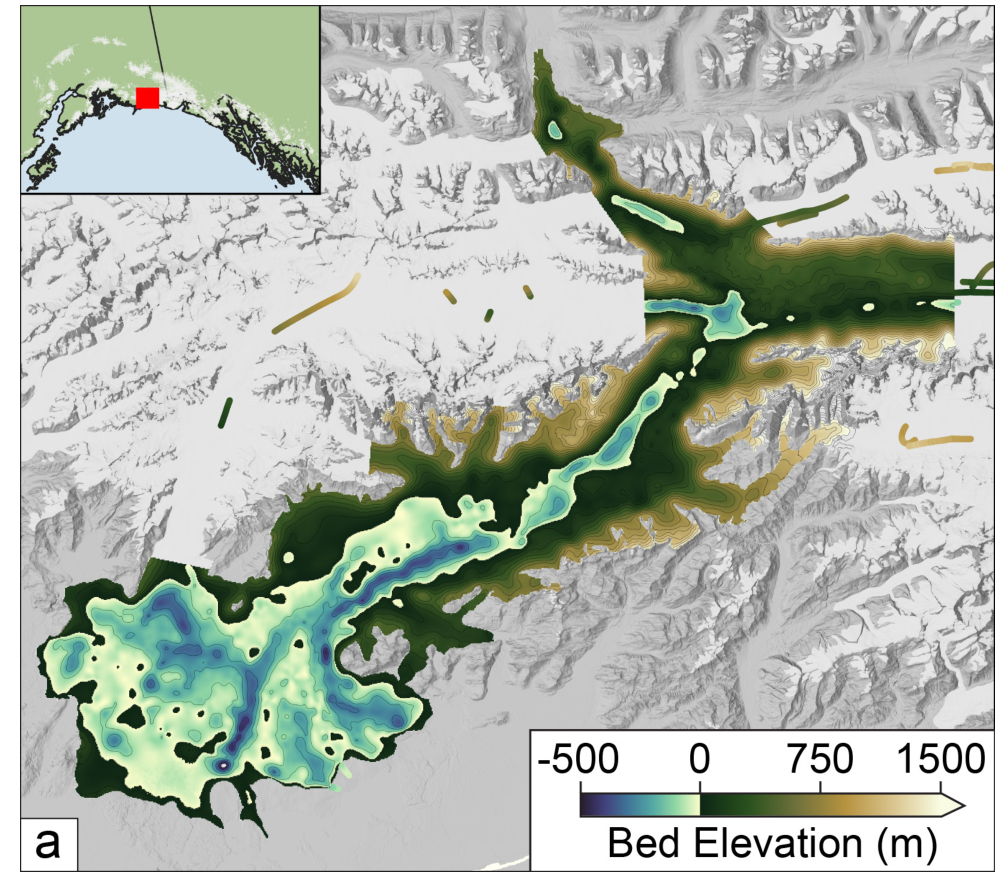
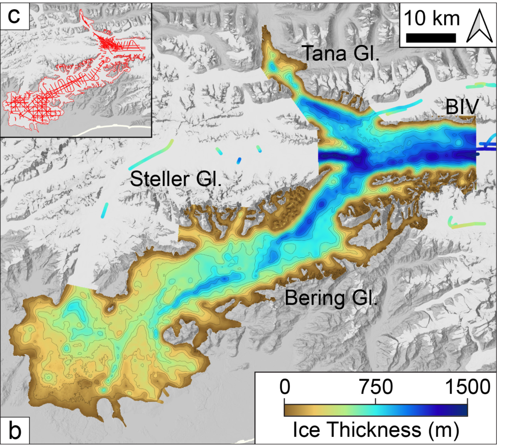
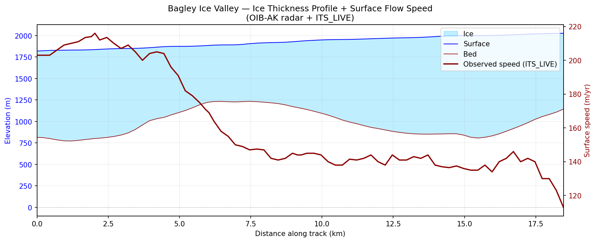

<!-- _header: "" -->
<!-- _paginate: false -->
<!-- _footer: "" -->


# Using Programmatic AWS-AI for Scientific Research

**CloudBank Cloud Clinic June 2026**

Using: AWS Bedrock, AI2 Asta and the AWS `kiro` IDE

---

<!-- _footer: "" -->

<style scoped>
li { font-size: 0.75em; }
</style>

# Previous CloudBank Cloud Clinics...

- Checkpointing and preemptible instances
- Mounting buckets on localhost
- Environmental sustainability on the cloud
- SkyPilot any-cloud cost optimized job management
- Virtual machines and their images
- Capacity blocks for machine learning
- Data publication and APIs
- Containerization with Docker
- Scaling out processing tasks (more containers)
- Working with coding assistants
- Connecting Azure to GitHub


---

## Theme for today


The non-profit Allen Institute for Artificial Intelligence abbreviates as "**AI2**". 


Let's look at the AWS Bedrock service. It routes prompts to selectable Foundation Models include Anthropic's Claude LLM. We pretend we are glaciologists interested in glacier thickness and surface velocity along the glacier centerline.


Let's work from an Integrated Development Environment (IDE) based on VS Code with a built-in Coding Assistant: `kiro` also provided by AWS. Paid subscription enabled ($20/month). 


Finally: AI2 offers AI-powered research services ($0). 


---


## Plan of action


1. AI2 Semantic Scholar API: Locate a paper
2. Download, extract text and figures
3. pdf > AWS Bedrock API > Claude Sonnet > summary
4. Associated code? Data? (ice thickness, velocity)
5. `kiro` > Python > illustrative charts
6. Pose a research question: Asta literature review
7. Asta experiment
8. Cost accounting
9. Open/public methods
10. Reflection: Use of the `kiro` IDE

---

## Step 1 · AI2 Semantic Scholar API: Locate a paper


We know that the NASA IceBridge mission produced a paper
and some data for glaciers in and near Alaska... so let's engage with
the AI2 "Semantic Scholar" service via their well-documented API:

<style scoped>
p, strong { font-size: 0.85em; }
code { font-size: 0.8em; }
</style>

**Tool:** localhost/kiro > AI2 Semantic Scholar REST API

```python
import requests

SEARCH_URL = "https://api.semanticscholar.org/graph/v1/paper/search"
params = {
    "query": "Alaskan glacier depths airborne radar sounding IceBridge",
    "fields": "title,authors,year,externalIds,openAccessPdf",
    "limit": 5,
}
response = requests.get(SEARCH_URL, params=params)
```

**Result:** Tober et al., "Alaskan Glacier Depths from a Decade of Airborne Radar Sounding"
DOI: `10.31223/X53T78` · https://eartharxiv.org/repository/etc

---

## Observations


laptop > Semantic Scholar > DOI > `doi.org` > EarthArXiv > PDF download link


- From a research topic and some keywords: `kiro` sorted out the API and wrote a `find_paper.py` Python program
- Semantic Scholar is a free service from the Allen Institute for AI focused on associative exploration of published research
- The API call required 8 lines of Python code (`requests` library)
- The target paper was found at EarthArXiv
- DOI > queryable, citable, connectable knowledge graph


---

## Step 2 · Extract Text from the PDF

**Tool:** pymupdf (localhost, no network)


"Oh you will need to install..." pattern


```python
import pymupdf

doc = pymupdf.open("tober_2025_alaskan_glacier_depths.pdf")
text = "\n".join(page.get_text() for page in doc)
```


- 43 pages → 79,738 characters
- Clean extraction
- Fits within Sonnet's 200k token context window

---

## Step 3 · Summarize via AWS Bedrock

**Tool:** boto3 → Bedrock → Claude Sonnet

```python
import boto3, json

client = boto3.client("bedrock-runtime", region_name="us-west-2")
body = json.dumps({
    "anthropic_version": "bedrock-2023-05-31",
    "max_tokens": 4096,
    "messages": [{"role": "user", "content": prompt}]
})
response = client.invoke_model(
    modelId="us.anthropic.claude-sonnet-4-6",
    contentType="application/json",
    accept="application/json",
    body=body
)
```

---

## Step 3 · Summary Result

**Key findings from the paper:**

- First comprehensive analysis of NASA Operation IceBridge radar data in Alaska (2012–2021)
- Over 5,500 linear-km of ice thickness measurements
- Many glacier termini have overdeepened beds
- Implications for proglacial lake formation and natural hazards

---

## Step 4 · Code and Data Availability

**Question to Sonnet:** "Does this paper reference code or data repositories?"

- **Code:** RAGU (Radar Analysis Graphical Utility) — `github.com/btobers/RAGU`
- **Data:** "Available upon manuscript publication" (per EarthArXiv metadata)
- **IceBridge source data:** Archived at NSIDC (NASA)

---

## From the Paper: Bed Elevation (Fig. 4a)



*Tober et al. (2025), CC BY 4.0*

---

## From the Paper: Ice Thickness (Fig. 4b)



*Tober et al. (2025), CC BY 4.0*

---

## Step 5 · Chart Glacier Thickness from the Data Repository



Generated from `OIB-AK_radar` KML + ITS_LIVE velocity (Kiro IDE → Python)

---

## Step 6 · Pose a Related Research Question

What does code/data availability mean for reproducibility?

- ✅ RAGU is open source (GPL v3), installable via pip
- ⚠️ Processed data not yet public (preprint stage)
- ✅ Source radar data available through NASA NSIDC
- A researcher could reproduce the analysis pipeline once data is released

---

## Step 6 · Pose a Related Research Question

**Prompt to Sonnet:** "Given these findings, propose a related research question."

Example hypothesis:
> *How do overdeepened glacier beds correlate with observed rates of terminus
> retreat across the Alaska Range, and can this predict future proglacial lake
> formation?*

---

## Step 7 · Ask Asta to Run an Experiment on Extracted Data

**Tool:** Semantic Scholar API

```python
params = {
    "query": "overdeepened glacier beds proglacial lake Alaska retreat",
    "fields": "title,authors,year,citationCount",
    "limit": 10,
}
```

Returns a curated list of related work — building a literature review programmatically.

---

## Step 8 · Cost Accounting

| Call | Input Tokens | Output Tokens | Cost |
|------|-------------|---------------|------|
| Summarize | 27,257 | 2,111 | $0.11 |
| Code/data | ~27,000 | ~500 | $0.09 |
| Hypothesis | ~27,000 | ~300 | $0.09 |
| **Total** | | | **~$0.29** |

The entire AI-assisted literature review costs less than a cup of coffee.

---

## Step 9 · Making Everything Open/Public

All of this lives in the `mimetes` repository:

```
mimetes/case_studies/03_arXiv/
├── find_paper.py        # Step 1: Search + download
├── extract_text.py      # Step 2: PDF → text
├── summarize.py         # Steps 3–4: Bedrock calls
├── bagley_profile.py    # Step 5: Chart from data
├── get_velocity.py      # Step 5: ITS_LIVE integration
├── StudyPlan.md         # Documentation
└── presentation.md      # This slide deck
```

Reproducible. Version-controlled. Portable (Docker).

---

## Step 10 · Building with the Kiro IDE

**Kiro** — an AI-assisted IDE built on VS Code

- The `mimetes` repository was developed interactively with Kiro
- Steering files guide the AI assistant's behavior
- Documentation updates automatically as progress is made
- The tool that builds the tool that does the science

---

## Summary

| What | How |
|------|-----|
| Find papers | Semantic Scholar API |
| Paper summary | pymupdf + AWS Bedrock > Claude Sonnet |
| Implications | AWS Bedrock iterative |
| Build literature reviews | Semantic Scholar + Bedrock |
| Cost | Pennies per paper |
| Reproducibility | Python + Git + Docker |

---

## Questions?

**Repository:** github.com/robfatland/mimetes
**Contact:** help@cloudbank.org

