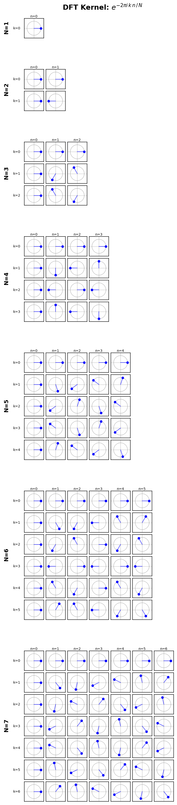
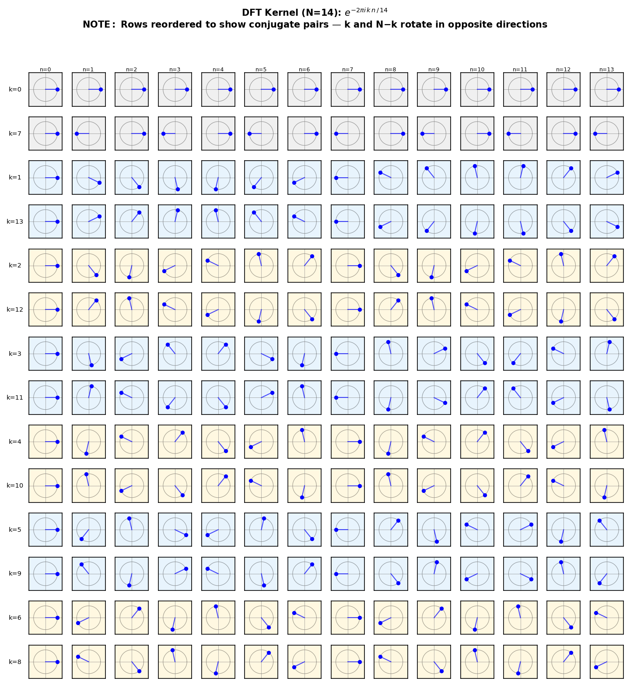

<!-- _header: "" -->
<!-- _paginate: false -->
<!-- _footer: "" -->

# The Discrete Fourier Transform

**CloudBank Cloud Clinic — TBD**

From complex numbers to frequency decomposition

---

## The Kernel

$$F_N[k, n] = e^{-2\pi i \, k \, n \,/\, N}$$

- **N** = number of samples (signal dimension)
- **k** = frequency index (row)
- **n** = time index (column)

Each entry is a point on the unit circle.

---

## N=1: The Trivial Case

$$F_1 = [1]$$

The transform of `[3]` is `[3]`. One sample, one frequency (DC).

$F_1$ is its own inverse: applying it twice returns the original.

---

## N=2: Sum and Difference

$$F_2 = \begin{pmatrix} 1 & 1 \\ 1 & -1 \end{pmatrix}$$

$$F_2 \cdot \begin{pmatrix} a \\ b \end{pmatrix} = \begin{pmatrix} a+b \\ a-b \end{pmatrix}$$

Row 0 = DC (sum). Row 1 = highest frequency (difference).

---

## Visualizing the Kernel: N=1 through N=7

---

## Conjugate Pairs: N=14

---

## The DFT as N Dot Products

Each row of $F_N$ is a "detector" — a complex sinusoid at frequency k.

The DFT projects your signal onto each detector.

**Large magnitude = that frequency is present.**

---

## Questions? Compliments?

**Repository:** github.com/robfatland/mimetes
**Contact:** help@cloudbank.org
