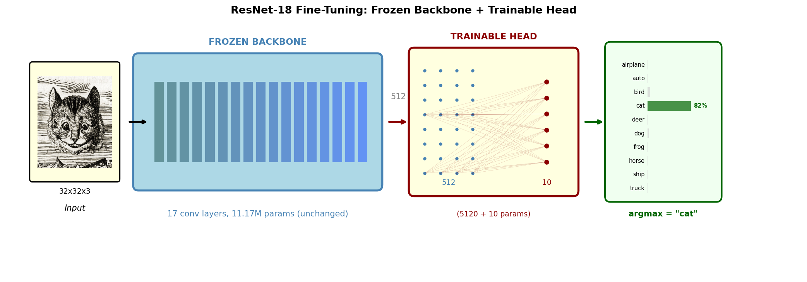

<!-- _header: "" -->
<!-- _paginate: false -->
<!-- _footer: "" -->

# PyTorch for Scientific Computing

**CloudBank Cloud Clinic July 2026**

Fine-tuning, training from scratch, and generative models

---

## ResNet-18 Fine-Tuning Architecture

---

## Questions? Compliments?

**Repository:** github.com/robfatland/mimetes
**Contact:** help@cloudbank.org
